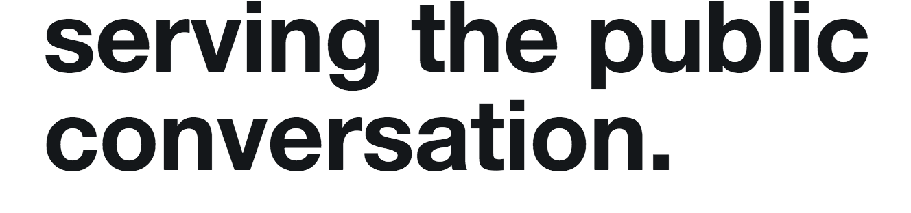
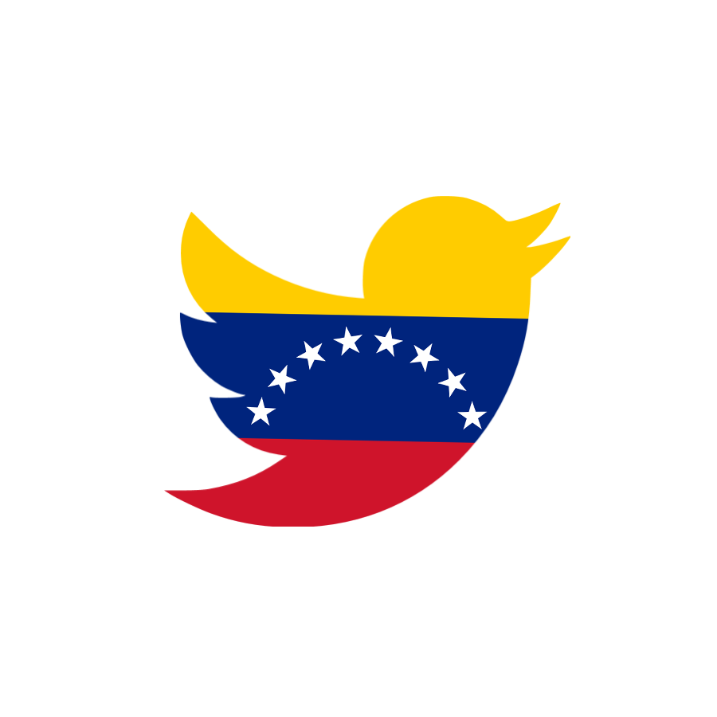
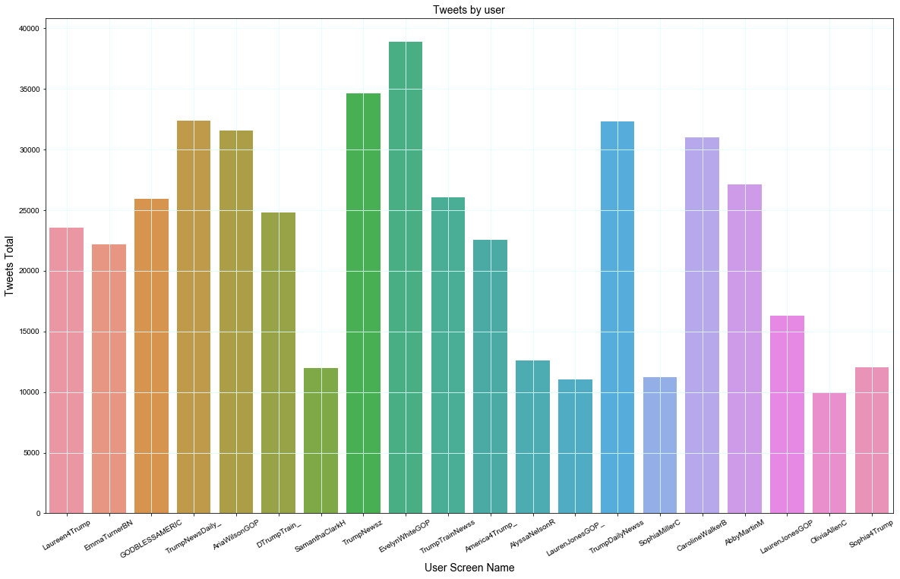
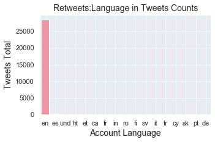
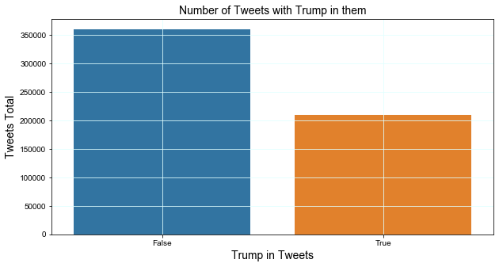
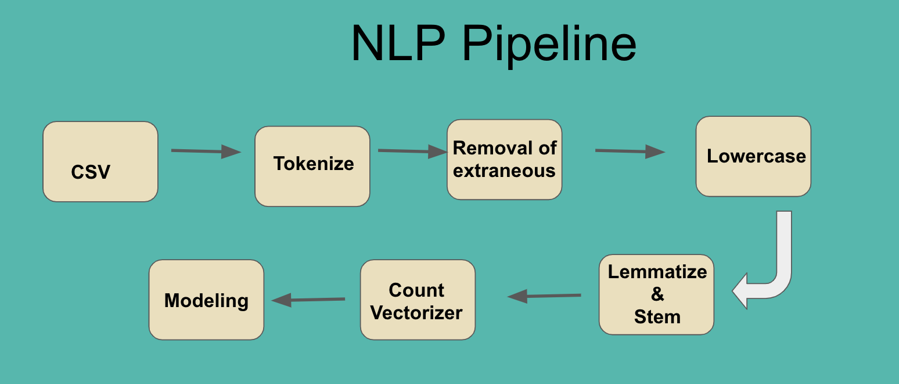
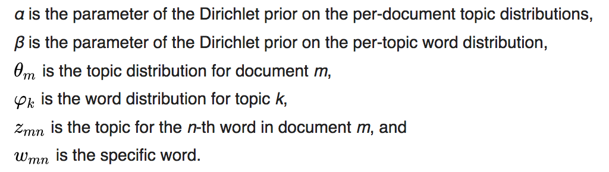
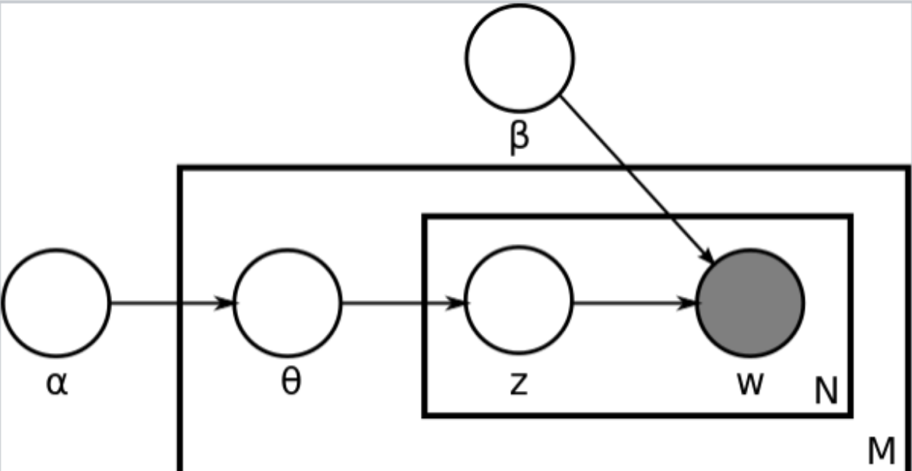
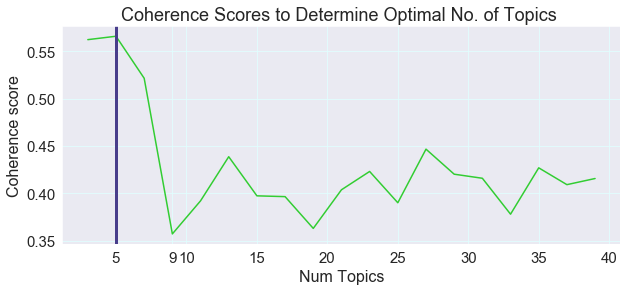
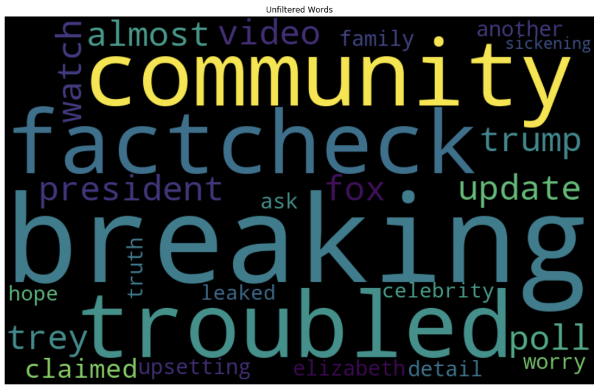

# Venezuelan-Intrusion
by James Clark

## Analysis of Banned Venezuelan Twitter Accounts

|| |
|----------------------------------------------|------------------------------------------|

# Table of Contents
- [Introduction](#Introduction)
- [Data Overview](#Data-Overview)
- [EDA](#EDA)
- [Data Pipeline](#Data-Pipeline)
- [Model-Selection](#Model-Selection)
- [Analysis of Tweet Emotions](#Analysis-of-Tweet-Emotions)
- [Conclusion and Next Steps](#Conclusion-and-Next-Steps)

## Introduction
As machine learning takes the world by storm the negative consequences of adversarial machine learning has become more apparent. This project  utilizes Twitter's Dataset to examine the role and scope of Venezuelan interference in the '16 and '18 elections. 

#### Goal:
- Ascertain if Venezuela attempted to interfere in our elections.
- Understand the impact and nature of Venezuelan interference.
- Create visualizations to make impact better understood.
- Implement Sentiment Analysis on Tweets.
- Unsupervised Learning: Use LDA to derive latent topic. 
- Supervised Learning: Utilize classification Algorithms to identify how many actors are active in this campaign.

#### Motivation:
A passion of mine is Political Science. I believe that High Tech can potentially make our society more Democratic, but also has the potential to undermine Democracies. By understanding these threats we can create greater protective measures to strengthen representative governments.

<a href="#Venezuelan-Intrusion">Back to top</a>

## Data Overview

#### First Dataset:
##### Twitter's Elections Integrity Dataset:
[Twitter Election Integrity Data Set, Venezuela](https://about.twitter.com/en_us/values/elections-integrity.html#data)

Collection of Tweets from Venezuelan accounts connected to state-sponsored disinformation campaigns.
- There are a half million tweets.
- Two Datasets: One dealing with tweets, the other with users.
- 33 Different Users.

#### Second Dataset:

##### [Emotions Sensor Data Set](https://www.kaggle.com/iwilldoit/emotions-sensor-data-set) 
- Contains over 21000 unique English words classified into 7 basic emotions: Disgust, Surprise, Neutral, Anger, Sad, Happy and Fear. 
- labeled using _Andbrain_(published on Kaggle) engine from over 1,185,540 classified words, blogs, tweets and sentences.

<a href="#Venezuelan-Intrusion">Back to top</a>

## EDA:

FEATURE ENGINEERING:

Performing EDA on our data set revealed a few things. They are summarized by the graphs below:

|Location of Users|Tweets per User|
|:---:|:---:|
|||

|Language in Tweet|Mentions of Trump|
|:---:|:---:|
|||

For further EDA please look at the summary [here](ExploratoryDataAnalysis.md)

<a href="#Venezuelan-Intrusion">Back to top</a>

## Data Pipeline
1.1.Words lemmatized, stemmed. Punctuation removed. 
 
 **Lemmatizing** means removing word endings to get to our target, the base or dictionary form of a word.   
Kittens - kitten, better - good, walking  - walk.  

 **Stemming** is the process of reducing words to their word stem, base or root form:  
cats, catlike, and catty, cat ---> cat  

`lemmer = WordNetLemmatizer()`  

`stemmer = SnowballStemmer('english')`  

1.3. Stop words. Noise.  
Standard stop words library from nltk was used.  
`stop_words = set(nltk.corpus.stopwords.words('english'))`  

1.4 More stopwords were arbitrary removed creating an additional 
additional stopwords list.

1.5. Emojies, Urls, Hashtags and Mentions were out of scope of this research and removed from text using [Twitter text preprocessor](https://pypi.org/project/tweet-preprocessor/):  
`pip instal tweet-preprocessor`

The code to do this can be found [here](src/text_preprocessor_functions.py)

<a href="#Venezuelan-Intrusion">Back to top</a>

# Model Selection:
## Unsupervised:

Methodology
[Latent Dirichlet Allocation](https://en.wikipedia.org/wiki/Latent_Dirichlet_allocation) is a generative statistical model of the joint probability distribution on _X × Y, P ( X , Y )_ that allows sets of observations to be explained by unobserved groups that explain why some parts of the data are similar and what are the similarities, what are the topics, the nodes of our text,  or  the abstract "topics" that occur in a collection of documents allowing us for discovery of _hidden semantic structures in a text body_ which is the goal of this project.  

Particular words will be found in the document more or less frequently: "surf" and "ocean" will appear more often in documents about surfing, "smoked salmon" and "dill" will appear in documents about Scandinavian recipes than others, and many common words that will appear equally in all topics.  
A document typically concerns multiple topics in different proportions; thus, in a document that is 80% about surfing and 20% about Scandinavian recipes, there would probably be about 8 times more words acount ocean and surf than about Scandinavian recipes. The "topics" produced by topic modeling techniques are clusters of similar words. A topic model captures this intuition in a mathematical framework, which allows examining a set of documents and discovering, based on the statistics of the words in each, what the topics might be and what each document's balance of topics is. 

|| |
|----------------------------------------------|------------------------------------------|

**LDA is an unsupervised technique**, meaning that we don’t know prior to running the model **how many topics** exits in our corpus. **Coherence score** is a metric and main technique used to estimate the number of topics and to measure human understandability and interpretability.

|LDA using Gridsearch|LDA using Gensim|
|:---:|:---:|
|||

|Optimized number of Topics|Word Cloud|
|:---:|:---:|
|||

The modeling methods I used were LDA and NMF. I utilized LDA four different ways: Simple Skilearn method, Grid search, Gensim, and LDA mallet. 

### Summary of LDA:
- Coherence score without stemming peaked at 56 %.
- Coherence score with stemming was 43 % using most methods.
- Except for LDA malley which had highest coherence score of 57 %.

SUMMARY OF DIFFERENT TOPICS:
All topics were Political. All were charged. Most mentioned Trump. Some models had god popping up more (NMF, it also had 'yuge' pop up). Hilary was also  in a lot of topics.

The code for this can be found [here](NLP_Models.ipynb)

## Supervised
Went through different machine learning algorithms in order to find a model that can predict the personalities. Random would be 1/16 or 0.0625. That is really low, so for our model let's aim to achiece results higher than 50%. The code for this can be found [here](NLP_Models.ipynb)

We will use the following models:
- Random Forest                 - Accuracy = 0.3614985590778098
- Gradient Boosting Classifier  - Accuracy = 0.650787552823665
- Naive Bayes                   - Accuracy = 0.22051479062620052
- Logistic Regression           - Accuracy = 0.6300422589320015
- Support Vector Machine        - Accuracy = 0.6699961582789089

<a href="#Venezuelan-Intrusion">Back to top</a>

# Analysis of Tweet Emotions:

The emotions Venezuela wanted us to feel were overwhelmingly negative, with 60 % of the emotions being registered being Fear, Surprise, Anger. A huge tweet spike occurred in the last quartile of 2016. This spike corresponds to the to the election of '16. Another spike of activity occurred in 2018 in the beginning of year (primary season) and another around the midterm election. 

|LDA using Gridsearch|LDA using Gensim|
|:---:|:---:|
|||

|Optimized number of Topics|Word Cloud|
|:---:|:---:|
|||

# Conclusion and Next Steps

- Took the datasets and performed Exploratory Data Analysis
- Created a data pipeline
- Built several models and picked support vector machine with stochastic gradient descent due to it's high accuracy and precision
- Built a Neural Network which improved gave great accuracy but was overfit to the over represnted classes
- Performed emotional analysis for each personality type
- Created Word Clouds based on the frequancy of words used by each personality type.
- Next step would be to gather data from another place like twitter or facebook and see if we can predict personalities based on that text

This project was really fun and informative for me because I was able to learn about Venezuelan interference on the side of Trump in the '16 election. This is information that is not widely known. After doing this project, I look at viral partisan posts in a different light, how many of likes on some of these posts are fake?

I'd love to continue using Data Science to explore topics relating politics.

<a href="#Venezuelan-Intrusion">Back to top</a>