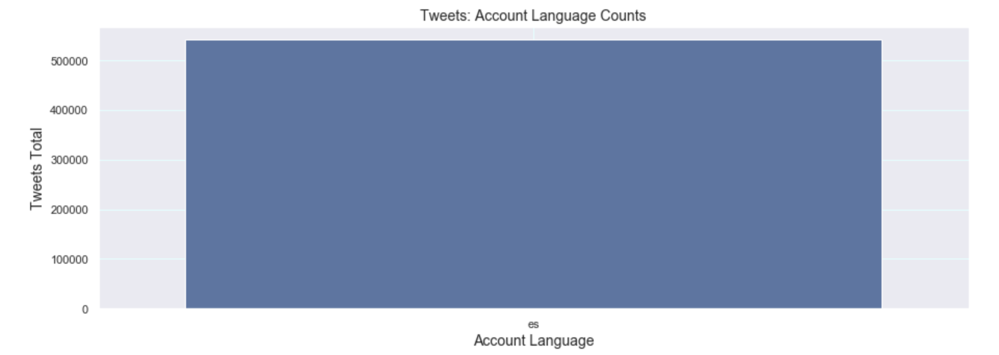
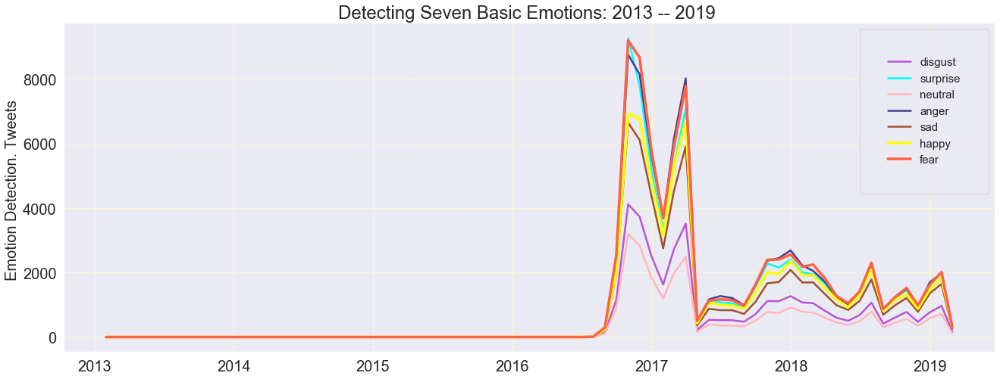
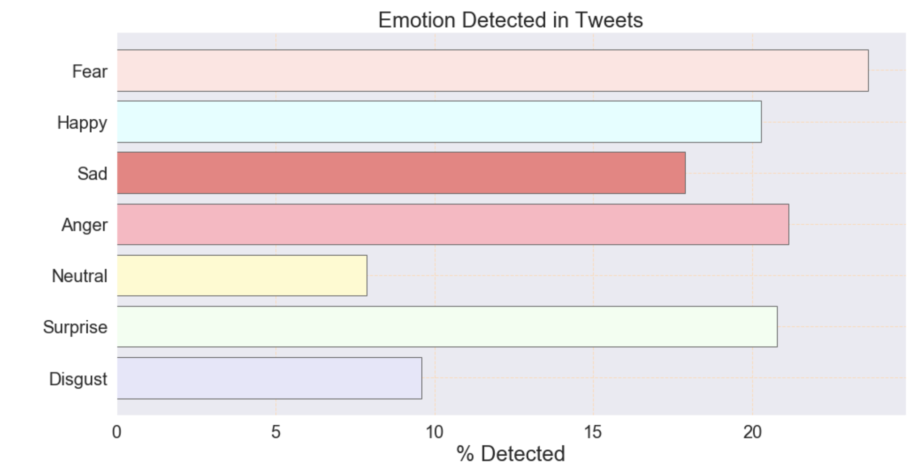

# Venezuelan-Intrusion
by James Clark

# Table of Contents
- [Introduction](#Introduction)
- [Data Overview](#Data-Overview)
- [EDA](#EDA)
- [Data Pipeline](#Data-Pipeline)
- [Model-Selection](#Model-Selection)
- [Analysis of Tweets w/ Sentiment Analysis](#Analysis-of-Tweets-with-Sentiment-Analysis)
- [Conclusion and Next Steps](#Conclusion-and-Next-Steps)

## Introduction
The negative consequences of adversarial machine learning has become more apparent, with the recent interference into the U.S election by Russia. This project  utilizes Twitter's Dataset to examine the role and scope of Venezuelan interference in the '16 and '18 elections. 

#### Goal:
- Ascertain if Venezuela attempted to interfere in our elections.
- Understand the impact and nature of Venezuelan interference.
- Create visualizations to make impact better understood.
- Implement Sentiment Analysis on Tweets.
-  Use LDA to derive latent topics. 
- Utilize sentiment analysis on Tweets.
- Utilize classification Algorithms to identify how many actors are active in this campaign.

#### Motivation:
A passion of mine is Political Science. I believe that High Tech can potentially make our society more Democratic, but also has the potential to undermine Democracies. By understanding these threats we can create greater protective measures to strengthen representative governments.

<a href="#Venezuelan-Intrusion">Back to top</a>

## Data Overview

#### First Dataset:
##### Twitter's Elections Integrity Dataset:
[Twitter Election Integrity Data Set, Venezuela](https://about.twitter.com/en_us/values/elections-integrity.html#data)

Collection of Tweets from Venezuelan accounts connected to state-sponsored disinformation campaigns.
- There are a half million tweets.
- Two Datasets: One dealing with tweets, the other with users.
- 33 Different Users.

#### Second Dataset:

##### [Emotions Sensor Data Set](https://www.kaggle.com/iwilldoit/emotions-sensor-data-set) 
- Contains over 21000 unique English words classified into 7 basic emotions: Disgust, Surprise, Neutral, Anger, Sad, Happy and Fear. 
- labeled using _Andbrain_(published on Kaggle) engine from over 1,185,540 classified words, blogs, tweets and sentences.

<a href="#Venezuelan-Intrusion">Back to top</a>

## EDA:

Performing EDA on the data set revealed a few things. They are summarized by the graphs below:

|Location of Users|
|:---:|
||

|All accounts registered as Spanish Language|Yet vast majority of actual Language in Tweets is English|
|:---:|:---:|
|||

For further EDA please look at the summary [here](ExploratoryDataAnalysis.md)

<a href="#Venezuelan-Intrusion">Back to top</a>

## Data Pipeline
1.1.Lemmatize and Stem Words. Remove punctuation. 
 
 **Lemmatizing** means removing word suffixes to get the base or dictionary form of a word.   
Kittens - kitten, better - good, walking  - walk.  

 **Stemming** is the process of reducing words to their word stem, base or root form:  
cats, catlike, and catty, cat ---> cat  

`lemmer = WordNetLemmatizer()`  

`stemmer = SnowballStemmer('english')`  

1.3. Stop words. Noise.  
Standard stop words library from nltk was used.  
`stop_words = set(nltk.corpus.stopwords.words('english'))`  

1.4. Emojies, Urls, Hashtags and Mentions removed from text using [Twitter text preprocessor](https://pypi.org/project/tweet-preprocessor/):  
`pip instal tweet-preprocessor`

The code to do this can be found [here](src/text_preprocessor_functions.py)

<a href="#Venezuelan-Intrusion">Back to top</a>
# Analysis of Tweets with Sentiment Analysis:

|Tweet Volume by 7 basic emotions| Tweet volume|
|:---:|:---:|
|||

|Optimized number of Topics|Tweet Volume peaks during '16 Election|
|:---:|:---:|
|||

## Results:

* A huge tweet spike occurred in the last quartile of 2016. This spike corresponds to the to the election of '16.  
* Another spike of activity occurred in 2018 in the beginning of year (primary season) and another around the midterm election.

* The emotions Venezuela wanted us to feel were overwhelmingly negative, with 60 % of the emotions being registered being Fear, Surprise, Anger. 

For further Tweet Analysi please look at the summary [here](TweetAnalysis.md)

<a href="#Venezuelan-Intrusion">Back to top</a>

# Model Selection:

**LDA is an unsupervised technique**, meaning that we don’t know prior to running the model **how many topics** exits in our corpus. **Coherence score** is a metric and main technique used to estimate the number of topics and to measure human understandability and interpretability.

|LDA using Gridsearch|LDA using Gensim|
|:---:|:---:|
|||

|Optimized number of Topics|
|:---:|:---:|
||

The modeling methods I used were LDA and NMF. I utilized LDA four different ways: Simple Skilearn method, Grid search, Gensim, and LDA mallet. 

### Summary of LDA:
- Coherence score without stemming peaked at 56 %.
- Coherence score with stemming was 43 % using most methods.
- Except for LDA mallet which had highest coherence score of 57 %.

SUMMARY OF DIFFERENT TOPICS:
All topics were Political. All were charged. Most mentioned Trump. Some models had god popping up more (NMF, it also had 'yuge' pop up). Hilary was also  in a lot of topics.

The code for this can be found [here](NLP_Models.ipynb)

## Supervised
Went through different machine learning algorithms in order to find a model that can predict the personalities. Random would be 1/16 or 0.0625. That is really low, so for our model let's aim to achiece results higher than 50%. The code for this can be found [here](NLP_Models.ipynb)

We will use the following models:
- Random Forest                 - Accuracy = 0.3614985590778098
- Gradient Boosting Classifier  - Accuracy = 0.650787552823665
- Naive Bayes                   - Accuracy = 0.22051479062620052
- Logistic Regression           - Accuracy = 0.6300422589320015
- Support Vector Machine        - Accuracy = 0.6699961582789089

The code for this can be found [here](NLP_Models.ipynb)

<a href="#Venezuelan-Intrusion">Back to top</a>
|

# Conclusion and Next Steps

- Took the datasets and performed Exploratory Data Analysis
- 
- Built several models and picked support vector machine with stochastic gradient descent due to it's high accuracy and precision
- Created Word Clouds based on the frequancy of words used by each personality type.
- Next step would be to gather data from another place like twitter or facebook and see if we can predict personalities based on that text

This project was really fun and informative for me because I was able to learn about Venezuelan interference on the side of Trump in the '16 election. This is information that is not widely known. After doing this project, I look at viral partisan posts in a different light, how many of likes on some of these posts are fake?

I'd love to continue using Data Science to explore topics relating politics.

<a href="#Venezuelan-Intrusion">Back to top</a>